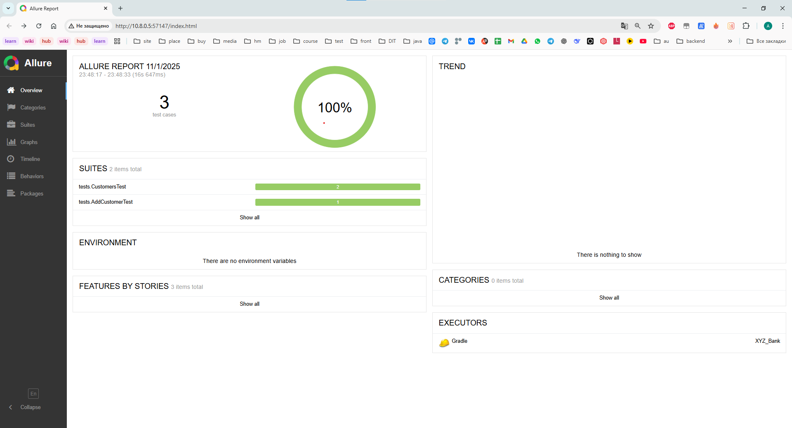
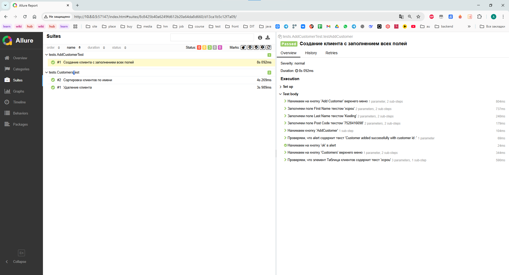
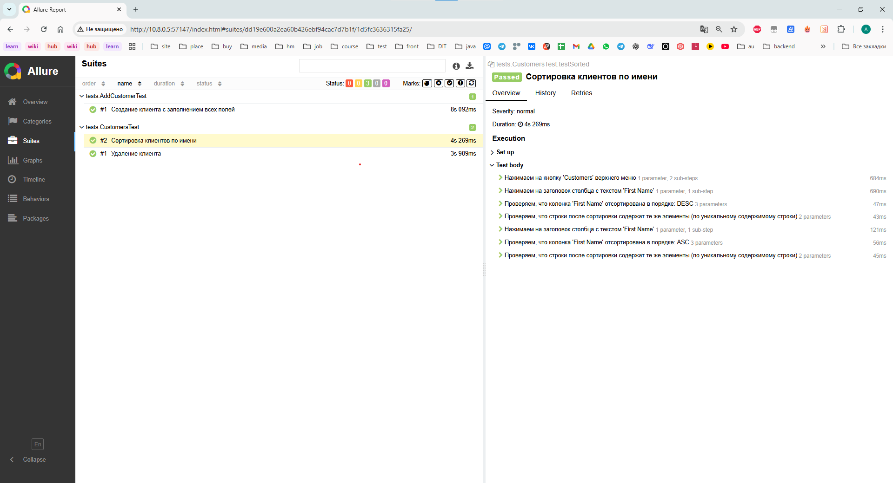
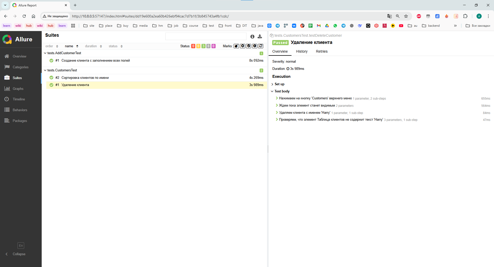
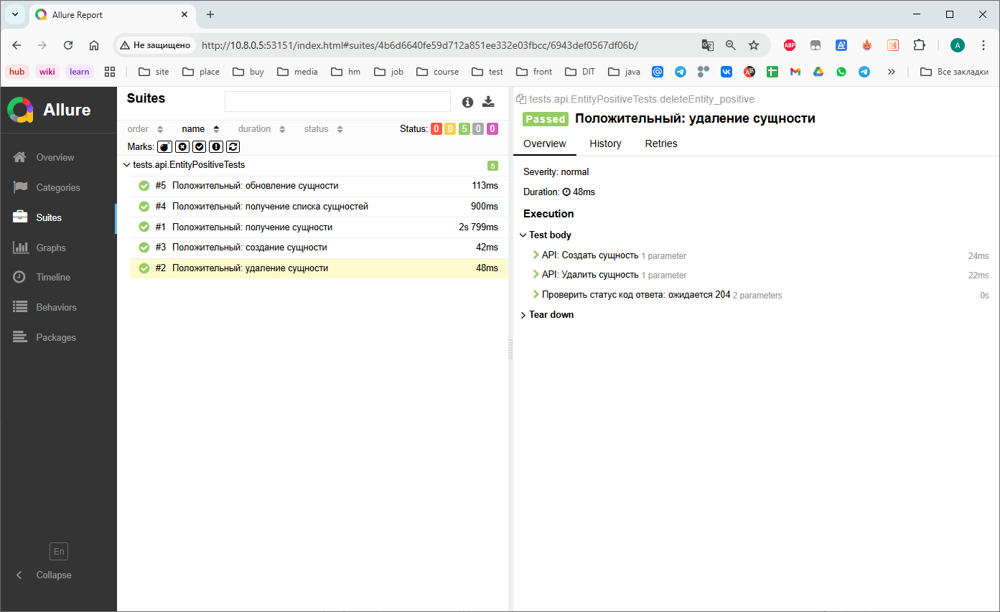

# Тестовое задание Панферовой Анастасии

## 📋 Описание проекта
Проект автоматизированных UI-тестов для сайта https://www.globalsqa.com/angularJs-protractor/BankingProject/#/
Проект также включает автоматизированное тестирование REST API для сущностей с методами CRUD.

## 📊 Allure отчет

<details>
<summary>📸 Посмотреть общий Allure отчет</summary>


</details>

<details>
<summary>📋 ТС-001: Создание клиента с заполнением всех полей</summary>


</details>

<details>
<summary>📋 ТС-002: Сортировка клиентов по имени</summary>


</details>

<details>
<summary>📋 ТС-003: Удаление клиента</summary>


</details>

<details>
<summary>API Tests</summary>


</details>

## 🧪 Тест-кейсы

## ТС-001: Создание клиента с заполнением всех полей
**Тип:** Позитивный  
**Предусловие:**
1. Открыть браузер
2. Перейти по ссылке https://www.globalsqa.com/angularJs-protractor/BankingProject/#/manager

| Шаги | Ожидаемый результат |
|------|---------------------|
| 1. Кликнуть кнопку Add Customer<br>2. Заполнить поле First Name сгенерированным именем на основе Post Code<br>3. Заполнить поле Last Name валидным значением, например Woodstok<br>4. Заполнить поле Post Code десятью цифрами<br>5. Нажать кнопку Add Customer | **Появилось всплывающее сообщение с текстом `Customer added successfully with customer id :`** |
| 6. В всплывающем сообщении кликнуть кнопку ок<br>7. Кликнуть на кнопку Customers<br>8. Проверить что в списке клиентов есть добавленный клиент | **В таблице отображается добавленный клиент** |

## ТС-002: Сортировка клиентов по имени
**Тип:** Позитивный  
**Предусловие:**
1. Открыть браузер
2. Перейти по ссылке https://www.globalsqa.com/angularJs-protractor/BankingProject/#/manager

| Шаги | Ожидаемый результат |
|------|---------------------|
| 1. Нажать кнопку Customers<br>2. Нажать на название колонки First Name<br>3. Проверить что Имена Клиентов отсортированы в обратном алфавитном порядке | **Имена отсортировались в обратном алфавитном порядке** |
| 4. Проверить что содержимое строк осталось таким же как было | **Строки остались такими же** |
| 5. Нажать на название колонки First Name<br>6. Проверить что Имена Клиентов отсортированы в алфавитном порядке | **Имена отсортировались в алфавитном порядке** |
| 7. Проверить что содержимое строк осталось таким же как было | **Строки остались такими же** |

## ТС-003: Удаление клиента
**Тип:** Позитивный  
**Предусловие:**
1. Открыть браузер
2. Перейти по ссылке https://www.globalsqa.com/angularJs-protractor/BankingProject/#/manager

| Шаги | Ожидаемый результат |
|------|---------------------|
| 1. Нажать кнопку Customers<br>2. Нажать кнопку удалить у клиента со среднее арифметическое получившихся длин из имен клиентов и удалить клиента с тем именем, у которого длина будет ближе к среднему арифметическому<br>3. Проверить что клиент не отображается | **Клиент не отображается** |

## 🧪 API-тестирование

### Цель
Проверка корректной работы REST API для сущностей (`Entity`) на эндпоинтах:
- `POST /api/create` – создание сущности
- `GET /api/get/{id}` – получение сущности по ID
- `GET /api/getAll` – получение списка всех сущностей
- `PATCH /api/patch/{id}` – обновление сущности
- `DELETE /api/delete/{id}` – удаление сущности

## 🛠 Технологии
- **Java 17**
- **Selenium WebDriver**
- **JUnit5**
- **Gradle**
- **Allure Reporting**
- **Data Faker**
- **Rest Assured**
- **Jackson**

## 🚀 Запуск тестов

### Локальный запуск
```bash
# Запуск всех тестов
./gradlew test

# Генерация Allure отчета
./gradlew allureServe
```

## 📝 Паттерны
- Page Object Model
- Page Factory
- Fluent Interface


